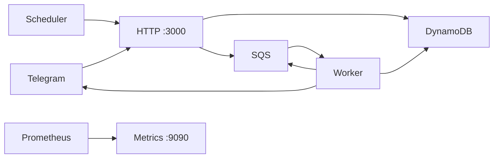

# telegram-jung2-bot

Add the bot to your group at [@jung2_bot](https://bit.ly/github-jung2bot)

**冗員**[jung2jyun4] Excess personnel in Cantonese

This bot is created for counting the number of messages per participant in a
chat group.

## Usage

| command     | info                                                                                                                      |
|-------------|---------------------------------------------------------------------------------------------------------------------------|
| `/topTen`   | Show the percentage of top ten participants for the past seven days                                                       |
| `/topDiver` | Show the percentage of top ten divers for the past seven days (Requires at least one message from the user to be counted) |
| `/allJung`  | Show the percentage of all participants for the past seven days                                                           |
| `/jungHelp` | Show help message                                                                                                         |

### Admin Only

| command                  | info                                                                                                                                                                                         |
|--------------------------|----------------------------------------------------------------------------------------------------------------------------------------------------------------------------------------------|
| `/enableAllJung`         | Enable `/allJung` command                                                                                                                                                                    |
| `/disableAllJung`        | Disable `/allJung` command                                                                                                                                                                   |
| `/setOffFromWorkTimeUTC` | Set offFromWork time in UTC. Format: `/setOffFromWorkTimeUTC {{ 0000-2345, 15 minutes interval }} {{ MON,TUE,WED,THU,FRI,SAT,SUN }}`. E.g. `/setOffFromWorkTimeUTC 1800 MON,TUE,WED,THU,FRI` |

## Architecture

The bot counts group messages, ranks speakers, and sends off-work reports.

| Process | Address | Role                                     |
|---------|---------|------------------------------------------|
| HTTP    | `:3000` | Webhook, `/health`, and scheduler routes |
| Metrics | `:9090` | `/metrics`                               |
| Worker  |         | SQS actions                              |

Code lives in `cmd/` and `internal/`. Buck2 builds and tests.

### Metrics

`/metrics` includes Go and process collectors plus:

| Metric                                                   | Meaning                           |
|----------------------------------------------------------|-----------------------------------|
| `telegram_jung2_bot_ready`                               | Readiness                         |
| `telegram_jung2_bot_http_requests_total`                 | HTTP requests                     |
| `telegram_jung2_bot_http_request_duration_seconds`       | HTTP duration                     |
| `telegram_jung2_bot_http_requests_in_flight`             | In-flight HTTP requests           |
| `telegram_jung2_bot_webhook_updates_total`               | Webhook outcomes                  |
| `telegram_jung2_bot_webhook_commands_enqueued_total`     | Commands queued                   |
| `telegram_jung2_bot_worker_actions_total`                | Queue actions                     |
| `telegram_jung2_bot_worker_action_duration_seconds`      | Queue action duration             |
| `telegram_jung2_bot_dependency_requests_total`           | DynamoDB, SQS, and Telegram calls |
| `telegram_jung2_bot_dependency_request_duration_seconds` | Outbound call duration            |
| `telegram_jung2_bot_off_work_reports_enqueued_total`     | Scheduled report enqueue results  |

HTTP metrics use fixed method, status, and route labels.

## Where is the JavaScript version?

This project started in [2016](https://github.com/siutsin/telegram-jung2-bot/pull/1),
more than a decade ago (!), as my technical
playground. It was a way to learn Node.js and the Telegram Bot API, and
to put a meme bot in my Telegram groups. For whatever reason it
spread, and thousands of groups were using it at that time.

Over time it became a lab for experiments: Heroku, PM2, Serverless Framework,
AWS ECS, Kubernetes, and more that I cannot even remember. The funny thing
is that I have not used this bot myself for a very long time.

The JavaScript ecosystem has constant supply-chain issues, and the number of
dependencies and their transitive dependencies is scary. I rewrote the
service in Go so that it would need almost no maintenance, whilst keeping it
running until no one is using it.

## Prerequisites

- [Buck2](https://buck2.build/docs/getting_started/)
- Go 1.27+
- Docker, for the optional Floci AWS integration check

## Commands

| Target               | What it does                                               |
|----------------------|------------------------------------------------------------|
| `make install-buck2` | Install or upgrade Buck2                                   |
| `make build`         | Build the service. Does not vendor.                        |
| `make ci`            | `vendor`, then `coverage` (runs `test`, which runs `lint`) |
| `make test`          | Lint, then fast race tests. Skips `slow`.                  |
| `make test-only`     | Tests without lint. CI runs this on arm64.                 |
| `make coverage`      | Fail unless `internal/` coverage is 100%                   |
| `make integration`   | Floci AWS tests. See `internal/integration/README.md`.     |
| `make lint`          | Go, shell, and Markdown checks                             |
| `make lint-fix`      | Apply supported lint fixes                                 |
| `make mock`          | Regenerate `internal/mock/`                                |
| `make vendor`        | Refresh vendor and third-party `BUCK` files                |
| `make clean`         | Remove Buck2 outputs                                       |
