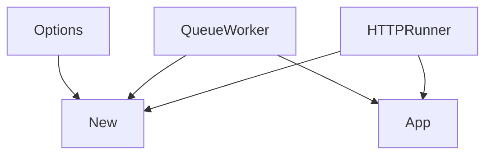
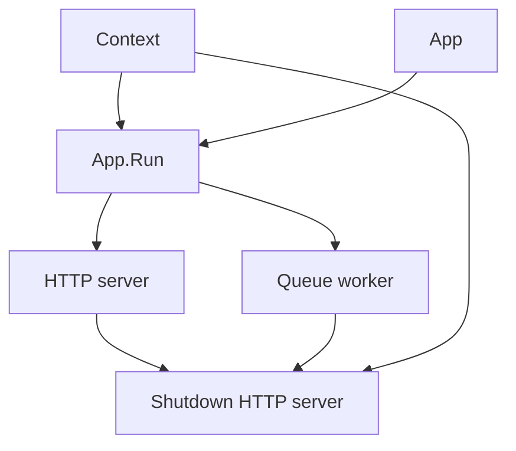

# `internal/app`

## Purpose

This package runs the service lifecycle.

It:

- starts both processes
- shuts down the HTTP server on exit

It does not load env vars or assemble production dependencies.

## Flow

### App creation flow

- `New` only wraps the provided HTTP server and queue worker.
- Startup assembly happens outside this package.

### Runtime flow

- `Run` starts the HTTP server and queue worker together.
- If either process returns, `Run` cancels the shared run context.
- On cancellation or process exit, `Run` shuts down the HTTP server with a timeout.

## Scope

This package owns:

- process lifecycle
- shutdown timeout selection

## Validation

`Run` fails when:

- the HTTP server is missing
- the queue worker is missing
- a process returns an error
- HTTP shutdown returns an error
