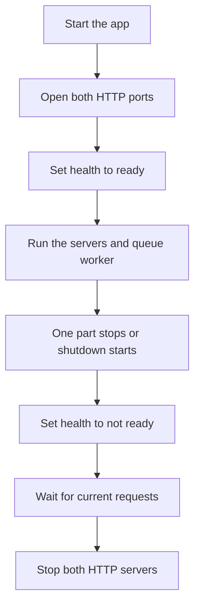

# `internal/app`

## Purpose

This package starts and stops the service.

It runs three parts:

- the webhook HTTP server
- the metrics HTTP server
- the queue worker

Kubernetes reads `/health`. A ready result means it can send traffic. A not
ready result means it must stop sending new traffic.

This package does not read environment variables or build production
dependencies.

## Flow

### What happens when the app runs

```mermaid
flowchart TD
    start[Start the app] --> ports[Open both HTTP ports]
    ports --> ready[Set health to ready]
    ready --> run[Run the servers and queue worker]
    run --> stop[One part stops or shutdown starts]
    stop --> unready[Set health to not ready]
    unready --> drain[Wait for current requests]
    drain --> shutdown[Stop both HTTP servers]
```

1. The app opens the webhook and metrics ports.
2. The app sets `/health` to ready.
3. The app runs the webhook server, metrics server, and queue worker.
4. If one part stops or shutdown starts, the app sets `/health` to not ready.
5. Kubernetes stops sending new traffic.
6. The app waits for requests that already started.
7. The app stops both HTTP servers.

## Scope

This package owns:

- process lifecycle
- readiness state
- readiness drain and shutdown timeout selection

## Validation

`Run` fails when:

- the webhook HTTP server is missing
- the metrics HTTP server is missing
- the queue worker is missing
- a process returns an error
- either HTTP shutdown returns an error
