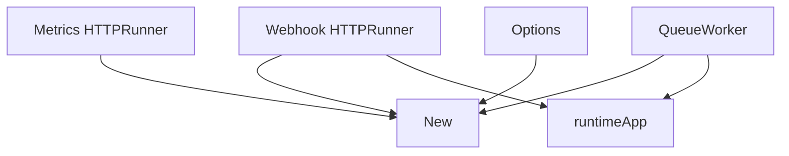
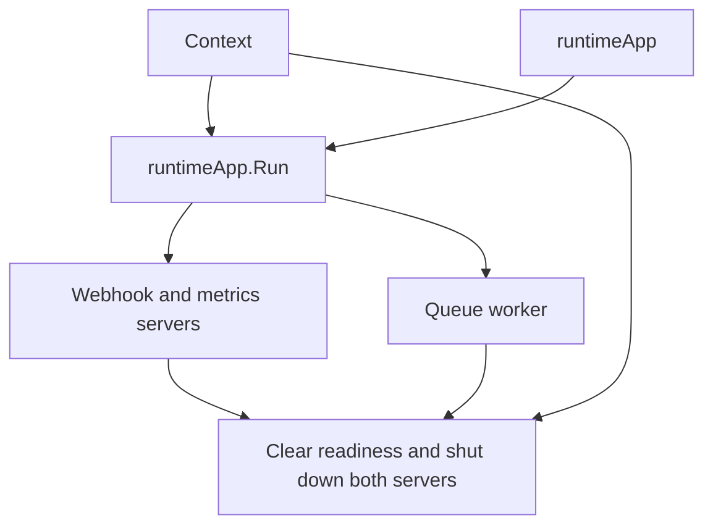

# `internal/app`

## Purpose

This package runs the service lifecycle.

It:

- starts the webhook HTTP server, metrics HTTP server, and queue worker
- exposes readiness only after both HTTP listeners bind
- drains readiness and shuts down both HTTP servers on exit

It does not load env vars or assemble production dependencies.

## Flow

### runtimeApp creation flow

```mermaid
flowchart TD
    httpServer[Webhook HTTPRunner] --> newApp[New]
    metricsServer[Metrics HTTPRunner] --> newApp
    queueWorker[QueueWorker] --> newApp
    opts[Options] --> newApp
    httpServer --> app[runtimeApp]
    queueWorker --> app
```

- `New` only wraps the provided HTTP server and queue worker.
- Startup assembly happens outside this package.

### Runtime flow

```mermaid
flowchart TD
    ctx[Context] --> run[runtimeApp.Run]
    app[runtimeApp] --> run
    run --> serve[Webhook and metrics servers]
    run --> poll[Queue worker]
    serve --> stop[Clear readiness and shut down both servers]
    poll --> stop
    ctx --> stop
```

- `Run` binds both HTTP listeners before it starts all components.
- `Run` marks readiness true only after both listeners bind.
- If either process returns, `Run` cancels the shared run context.
- On cancellation or process exit, `Run` marks readiness false, waits for the
  configured drain time, then shuts down both HTTP servers with a timeout.

## Scope

This package owns:

- process lifecycle
- readiness state
- readiness drain and shutdown timeout selection

## Validation

`Run` fails when:

- the webhook HTTP server is missing
- the metrics HTTP server is missing
- the queue worker is missing
- a process returns an error
- either HTTP shutdown returns an error
