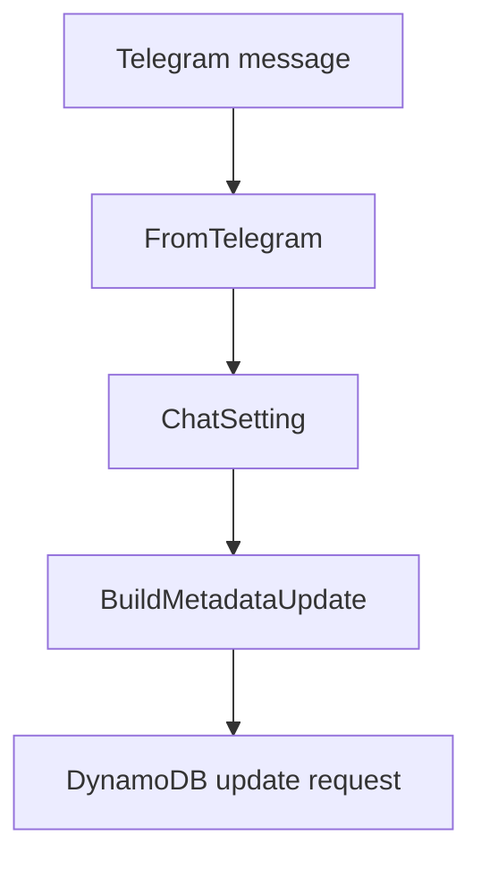
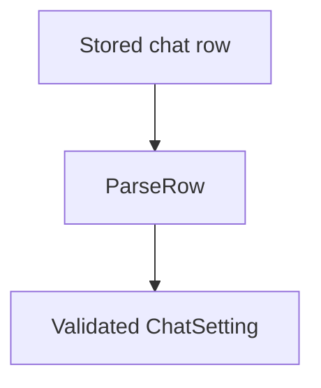
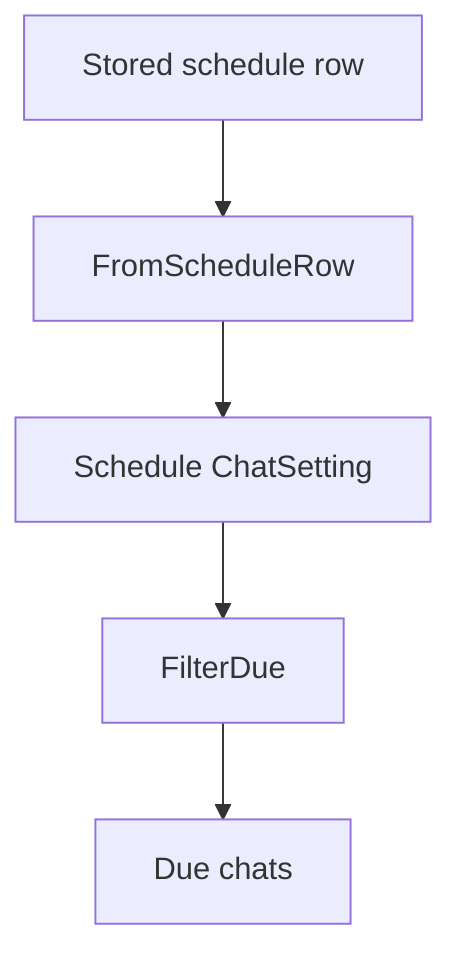

# `internal/chat`

## Purpose

This package parses stored chat rows, builds chat update shapes, and filters scheduled chats.

It:

- parses stored chat rows
- builds chat update requests
- applies stored chat defaults
- filters chats for scheduled reports

It does not talk to DynamoDB directly.

## Dependencies

This package depends on:

- `internal/message`
- `internal/telegram`
- `internal/workday`

## Flow

### Telegram metadata flow

- `FromTelegram` builds chat metadata from one Telegram message.
- `BuildMetadataUpdate` turns those settings into the DynamoDB update shape used
  to save chat metadata.

### Full row parsing flow

- `ParseRow` is the strict path for full stored chat rows.
- It applies defaults, including `enableAllJung=true` when the stored value is missing.
- It parses `dateCreated` and validates `workday`.
- This path returns an error when stored data is malformed.

### Schedule filtering flow

- `FromScheduleRow` is the permissive path for scheduled fan-out.
- It ignores `dateCreated` and masks unknown `workday` bits instead of failing.
- `FilterDue` keeps only chats that match the requested off-work time and day.

## Scope

This package owns:

- chat setting models
- stored row parsing
- chat update request shapes
- chat defaulting
- due-chat filtering

## Validation

Chat loading fails when:

- stored `dateCreated` is invalid
- stored `workday` is invalid in full row parsing
