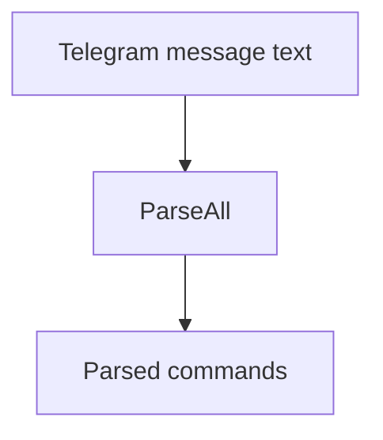
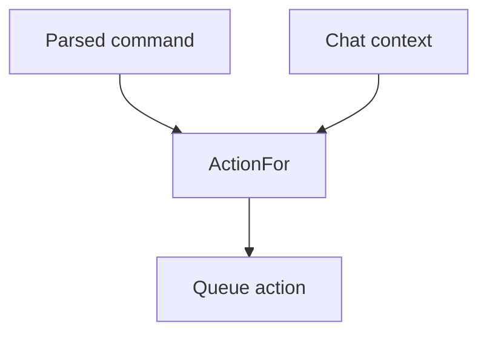

# `internal/command`

## Purpose

This package parses supported Telegram commands and builds queue actions.

It:

- finds supported command names in message text
- keeps contract command casing
- extracts command args
- converts commands into queue actions

It does not send messages or handle queue work.

## Dependencies

This package depends on:

- `internal/queue`
- `internal/workday`

## Flow

### Command parsing flow

- `ParseAll` finds supported commands in message text.
- Command matching preserves the deployed prefix behaviour.
- It keeps the contract command casing.
- It returns commands in the fixed contract order, not text order.

### Action building flow

- `ActionFor` turns one parsed command into one queue action.
- It adds required chat and user attributes.
- `setOffFromWorkTimeUTC` also validates and normalises `offTime` and `workday`.

## Scope

This package owns:

- Telegram command parsing
- set-off-from-work arg parsing
- command to action mapping
- set-off-from-work arg validation

## Validation

Action creation fails when:

- the command is not supported
- set-off-from-work args are invalid
