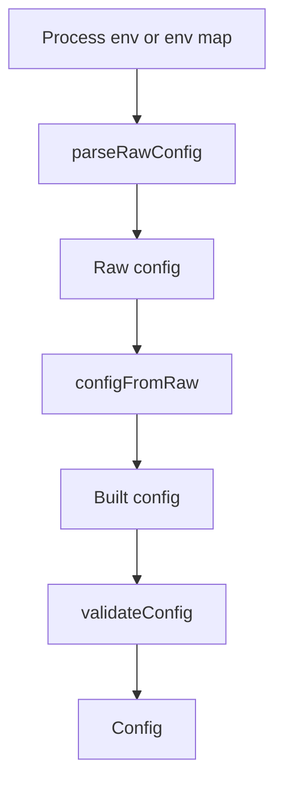

# `internal/config`

## Purpose

This package loads startup config from environment variables.

It:

- reads env vars
- applies defaults
- validates required values
- returns `config.Config`

It does not build clients or start the app.

## Dependency

This package depends on `github.com/caarlos0/env/v11`.

## Flow

### Environment loading flow

- `LoadEnviron` converts process-style env entries and calls `Load`.
- `parseRawConfig` reads env values into the raw config shape.
- `configFromRaw` applies defaults and parses timeout overrides.
- `validateConfig` checks table names and URLs before startup continues.

## Scope

This package owns:

- env parsing
- startup defaults
- startup validation
- typed startup config

## Validation

Startup fails when:

- a required setting is missing
- a table name is invalid
- a required URL is invalid
- an optional URL is set but invalid
- a timeout override is not a positive integer

## Fallbacks

These do not fail startup:

- bad process-style env entries passed to `LoadEnviron`
- invalid `SCALE_UP_READ_CAPACITY`, which falls back to `0`
