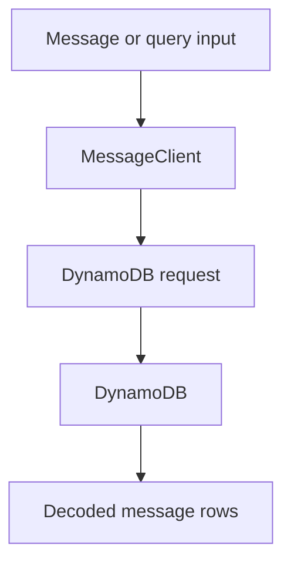
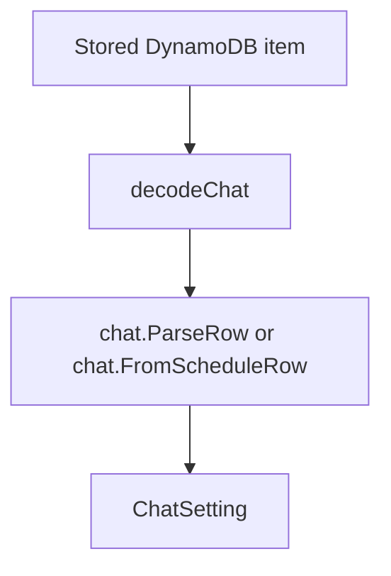
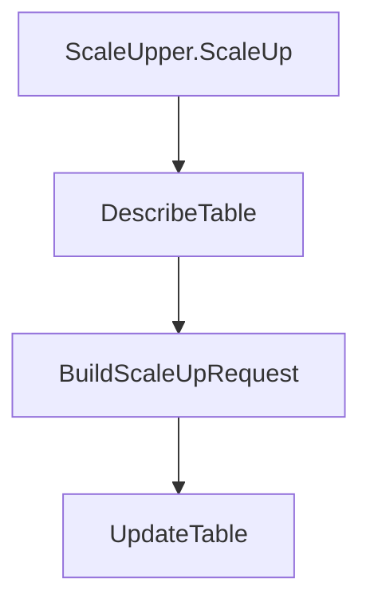

# `internal/dynamodb`

## Purpose

This package adapts the internal storage contracts to DynamoDB.

It:

- builds DynamoDB request shapes
- encodes and decodes DynamoDB values
- handles DynamoDB pagination
- implements the concrete chat, message, and scale-up adapters

It does not own chat, message, or schedule rules.

## Dependencies

This package depends on:

- `internal/chat`
- `internal/message`
- `internal/schedule`
- `internal/workday`
- AWS DynamoDB SDK

## Flow

### Message flow

- `MessageClient` saves message rows and queries stored message history.
- Query methods keep following `LastEvaluatedKey` until DynamoDB is done.

### Chat flow

- `ChatClient.Get` uses the strict `chat.ParseRow` path.
- schedule-facing scans use the permissive `chat.FromScheduleRow` path.

### Scale-up flow

- `ScaleUpper` reads current throughput, builds the target request, then updates the table.
- some known DynamoDB scale-up errors are ignored to match the reference behaviour.

## Scope

This package owns:

- DynamoDB client adapters
- DynamoDB request encoding
- DynamoDB item decoding
- pagination loops

## Validation

Calls fail when:

- a DynamoDB SDK call fails
- a stored chat row is malformed on the strict read path
- a stored message row cannot be decoded

## Fallbacks

These do not fail:

- invalid `DesiredRead` in scale-up, which falls back to the current read capacity
- known ignorable scale-up errors
