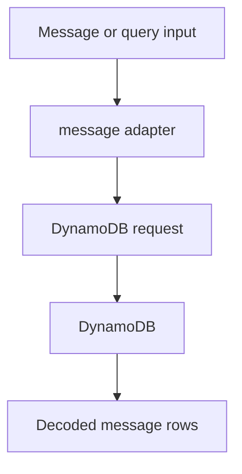
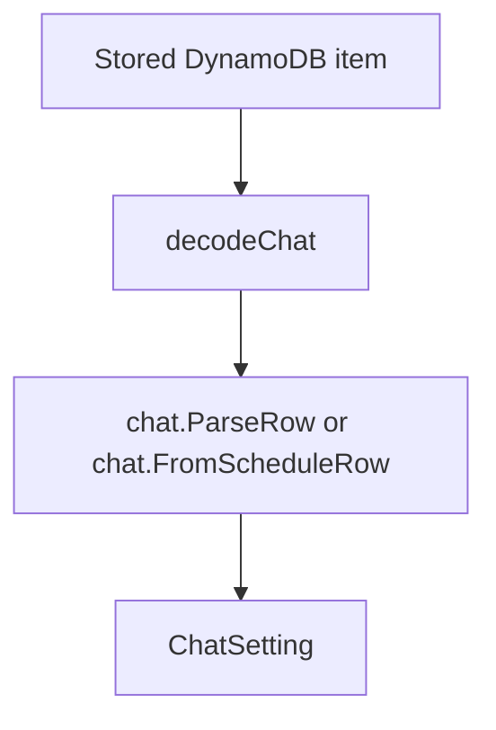
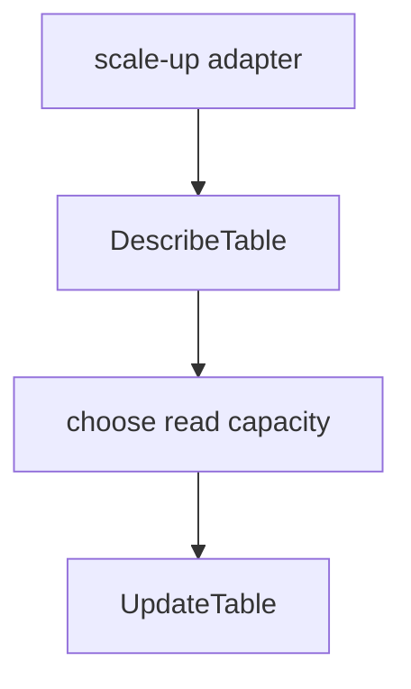

# `internal/dynamodb`

## Purpose

This package adapts the internal storage contracts to DynamoDB.

It:

- builds DynamoDB request shapes
- encodes and decodes DynamoDB values
- handles DynamoDB pagination
- implements the concrete chat, message, and scale-up adapters

It does not own chat, message, or schedule rules.

## Dependencies

This package depends on:

- `internal/chat`
- `internal/message`
- `internal/schedule`
- `internal/workday`
- AWS DynamoDB SDK

## Flow

### Message flow

- the message adapter saves message rows and queries stored message history.
- Query methods keep following `LastEvaluatedKey` until DynamoDB is done.

### Chat flow

- the chat adapter `Get` path uses the strict `chat.ParseRow` path.
- schedule-facing scans use the permissive `chat.FromScheduleRow` path.

### Scale-up flow

- the scale-up adapter reads current throughput, chooses the target read capacity, then updates the table.
- some known DynamoDB scale-up errors are ignored to match the deployed behaviour.

## Scope

This package owns:

- DynamoDB client adapters
- DynamoDB request encoding
- DynamoDB item decoding
- pagination loops

## Public API

- `NewMessageClient` returns `MessageClient`
- `NewChatClient` returns `ChatClient`
- `NewScaleUpper` returns `ScaleUpper`

## Files

- `chat.go`: chat read, write, statistics, and due-chat adapter
- `client.go`: adapter types, constructors, and the private DynamoDB SDK interface
- `codec.go`: DynamoDB value encoding and decoding
- `message.go`: message save and query adapter
- `pagination.go`: shared paginated fetch loop
- `scale.go`: table read-capacity scale-up adapter
- `update.go`: shared `UpdateItem` bridge

## Internal helpers

- `collectPages` stays generic because the same pagination flow is reused for
  message rows, chat settings, and chat IDs.
- `buildMessageSaveUpdate` preserves the deployed message persistence shape.
- `updateContractUpdate` is the bridge from SDK-free update shapes to the final
  DynamoDB `UpdateItem` call.

## Validation

Calls fail when:

- a DynamoDB SDK call fails
- a stored chat row is malformed on the strict read path
- a stored message row cannot be decoded

## Fallbacks

These do not fail:

- known ignorable scale-up errors
