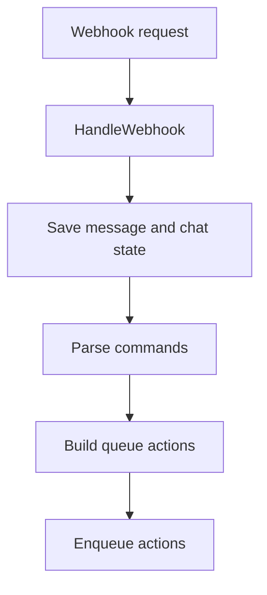
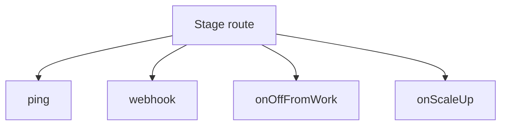

# `internal/httpserver`

## Purpose

This package handles HTTP transport for the bot.

It:

- builds the production HTTP server
- parses webhook requests
- saves webhook state
- turns commands into queue actions
- exposes contract stage routes

It does not own chat, message, schedule, or queue rules.

## Dependencies

This package depends on:

- `internal/chat`
- `internal/command`
- `internal/message`
- `internal/queue`
- `internal/schedule`
- `internal/telegram`

## Flow

### Webhook flow

- webhook handling first checks the Telegram payload shape
- then it saves message and chat state
- then it turns supported commands into queue actions

### Stage route flow

- the stage-prefixed routes keep the reference route shape
- `/ping`, `/onOffFromWork`, and `/onScaleUp` are handled here

## Scope

This package owns:

- HTTP route wiring
- webhook transport handling
- stage route handling
- HTTP response shaping

## Validation

Server creation fails when:

- required handler dependencies are missing

Webhook handling returns an error response when:

- the request body cannot be read
- the Telegram payload is invalid
- message or chat persistence fails
- queue enqueue fails
