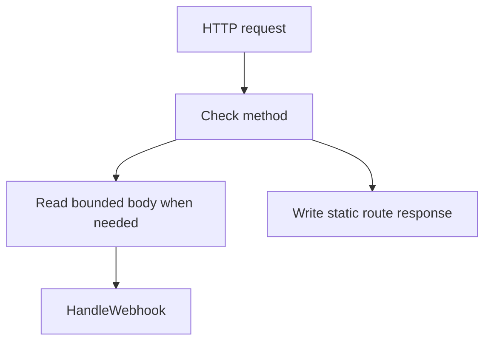
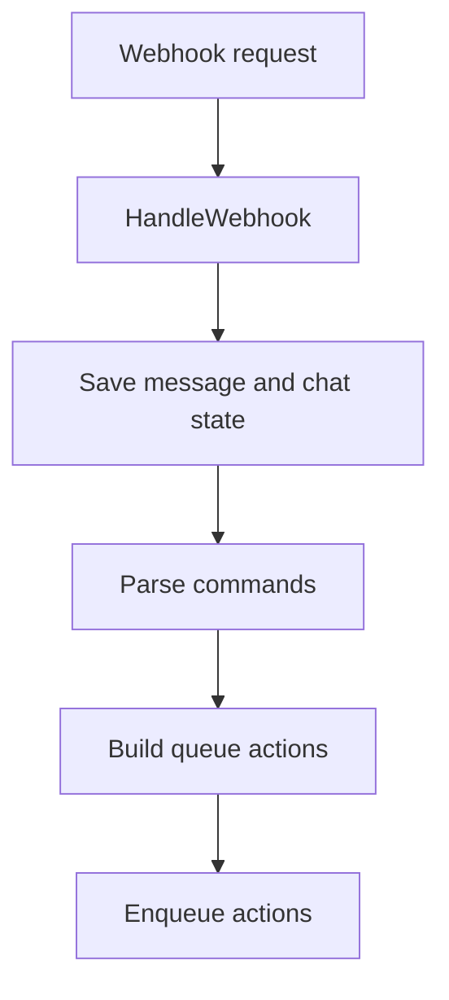
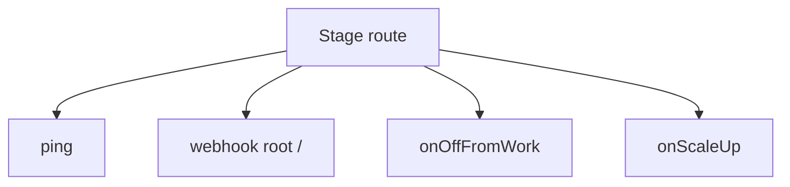

# `internal/httpserver`

## Purpose

This package handles HTTP transport for the bot.

It:

- builds the production HTTP server
- exposes native and legacy-compatible HTTP routes
- reads bounded webhook request bodies
- parses Telegram webhook requests
- saves webhook state
- turns commands into queue actions

It does not own chat, message, schedule, or queue rules.

## Dependencies

This package depends on:

- `internal/chat`
- `internal/command`
- `internal/message`
- `internal/queue`
- `internal/schedule`
- `internal/telegram`

## Flow

### Route flow

- unsupported methods return `405 Method Not Allowed`
- webhook body reads are bounded by `MaxBodyBytes` or the default 1 MiB limit
- native routes use plain responses, while legacy stage routes use JSON

### Webhook flow

- webhook handling first checks the Telegram payload shape
- then it saves message and chat state
- then it turns supported commands into queue actions

### Stage route flow

- stage-prefixed routes preserve the legacy Fastify route shape from
  `legacy/src/index.js`
- `/jung2bot/{stage}/ping` returns `{"health":"ok"}`
- `/jung2bot/{stage}/` accepts webhook `POST` requests and returns a
  `{"statusCode":...}` JSON object
- `/jung2bot/{stage}` without the trailing slash remains `404`
- `/jung2bot/{stage}/onOffFromWork` enqueues the off-work action and returns
  `202` with `{"onOffFromWork":"ok"}`
- `/jung2bot/{stage}/onScaleUp` returns `200` with `{"onScaleUp":"ok"}` on
  success and `503` with `{"onScaleUp":"failed"}` on failure

## Scope

This package owns:

- HTTP route wiring
- webhook transport handling
- stage route handling
- HTTP response shaping

## File Layout

- `httpserver.go` defines package contracts, dependency structs, health, and
  production server construction
- `routes.go` wires native and legacy-compatible HTTP routes
- `webhook.go` handles Telegram webhook parsing, persistence, command parsing,
  and enqueueing
- `response.go` writes plain and legacy JSON HTTP responses
- `validation.go` checks required dependencies and body-size defaults
- `*_test.go` files mirror the same boundaries: server setup, routes,
  webhook flow, validation, and shared generated mock helpers

## Validation

Server creation fails when:

- required handler dependencies are missing

Webhook handling returns an error response when:

- the request body cannot be read
- the Telegram payload is invalid
- message or chat persistence fails
- queue enqueue fails

## Tests

The tests keep legacy parity with table-driven cases for:

- unsupported route methods
- exact stage webhook path matching
- webhook parse responses
- non-command messages that should save without enqueueing
- dependency validation and dependency error responses

Tests that assert side effects, such as saved rows, queue action attributes, or
Telegram replies, stay explicit so contract details remain easy to inspect.
