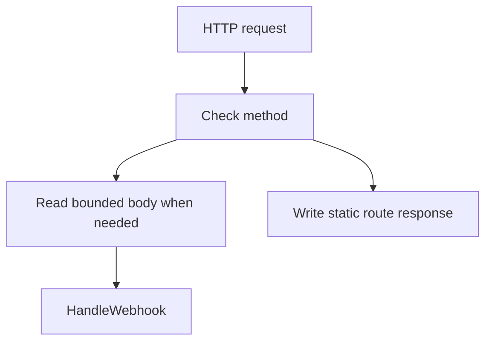
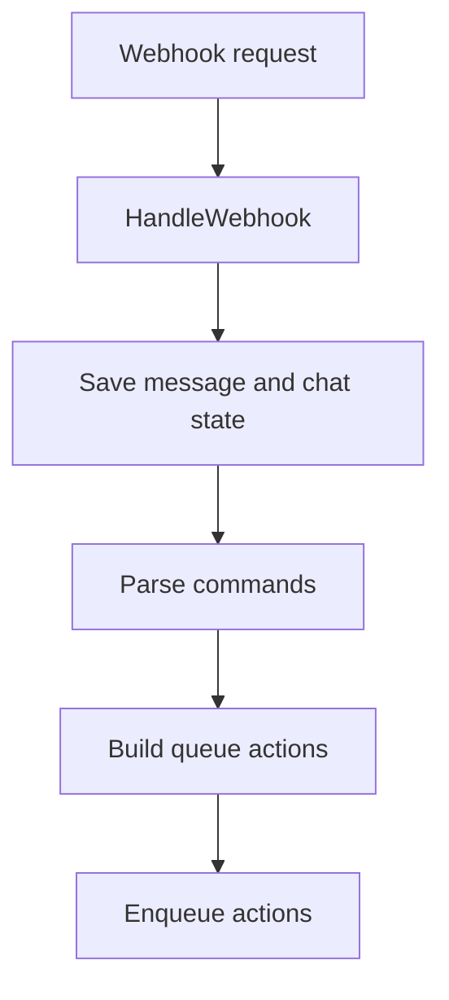
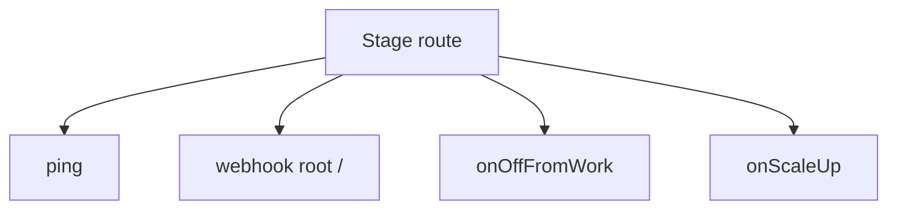

# `internal/httpserver`

## Purpose

This package handles HTTP transport for the bot.

It:

- builds the production HTTP server
- exposes native and stage-compatible HTTP routes
- reads bounded webhook request bodies
- parses Telegram webhook requests
- saves webhook state
- turns commands into queue actions

It does not own chat, message, schedule, or queue rules.

## Dependencies

This package depends on:

- `internal` (`bot`)
- `internal/queue`

## Flow

### Route flow

```mermaid
flowchart TD
    route[HTTP request] --> method[Check method]
    method --> body[Read bounded body when needed]
    body --> webhook[HandleWebhook]
    method --> static[Write static route response]
```

- unsupported methods return `405 Method Not Allowed`
- webhook body reads are bounded by `MaxBodyBytes` or the default 1 MiB limit
- native routes use plain responses, while stage routes use JSON

### Webhook flow

```mermaid
flowchart TD
    request[Webhook request] --> parse[HandleWebhook]
    parse --> save[Save message and chat state]
    save --> commands[Parse commands]
    commands --> actions[Build queue actions]
    actions --> enqueue[Enqueue actions]
```

- webhook handling first checks the Telegram payload shape
- then it saves message and chat state
- then it turns supported commands into queue actions

### Stage route flow

```mermaid
flowchart TD
    stage[Stage route] --> ping[ping]
    stage --> webhook["webhook root /"]
    stage --> offwork[onOffFromWork]
    stage --> scaleup[onScaleUp]
```

- stage-prefixed routes preserve the deployed route shape
- `/health` returns `200` only while the app is ready for new traffic
- `/jung2bot/{stage}/ping` returns `{"health":"ok"}`
- `/jung2bot/{stage}/` accepts webhook `POST` requests and returns a
  `{"statusCode":...}` JSON object
- `/jung2bot/{stage}` without the trailing slash remains `404`
- `/jung2bot/{stage}/onOffFromWork` enqueues the off-work action and returns
  `202` with `{"onOffFromWork":"ok"}`
- `/jung2bot/{stage}/onScaleUp` returns `200` with `{"onScaleUp":"ok"}` on
  success and `503` with `{"onScaleUp":"failed"}` on failure

## Scope

This package owns:

- HTTP route wiring
- webhook transport handling
- stage route handling
- HTTP response shaping

## Validation

Server creation fails when:

- required handler dependencies are missing

Webhook handling returns an error response when:

- the request body cannot be read
- the Telegram payload is invalid
- message or chat persistence fails
- queue enqueue fails

## Tests

The tests keep deployed-route contract coverage with table-driven cases for:

- unsupported route methods
- exact stage webhook path matching
- webhook parse responses
- non-command messages that should save without enqueueing
- dependency validation and dependency error responses
