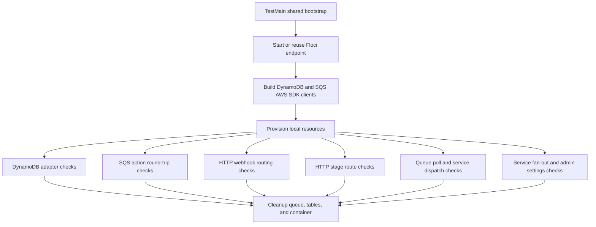

# `internal/integration`

## Purpose

This package contains the opt-in Floci-backed integration test for local AWS
adapter coverage.

It:

- starts a local Floci AWS emulator through Testcontainers-Go
- provisions temporary DynamoDB tables and an SQS queue
- exercises the real AWS SDK v2 DynamoDB and SQS adapters
- verifies queue action round-trips for every command action shape
- covers HTTP webhook and stage routing through production handlers
- exercises service-layer side effects with a recording Telegram messenger

It does not run as part of the fast test or coverage gate.

## Running

```bash
make integration
```

The target runs the slow Buck `go_test` target:

```bash
buck2 test -m toolchains//:race //internal/integration:floci_integration_test -- --env INTEGRATION_TESTS=1
```

Environment variables:

- `INTEGRATION_TESTS=1` is required; otherwise the test skips.
- `FLOCI_ENDPOINT` reuses an already-running Floci-compatible AWS endpoint.
- `FLOCI_IMAGE` overrides the default `floci/floci:latest` container image.
- `AWS_REGION` overrides the local AWS SDK region, defaulting to `eu-west-1`.

`make test` excludes this target through the Buck `slow` label. `make coverage`
also filters it out of the coverage target list.

The package runs one shared Floci environment through `TestMain`, then executes
these top-level tests individually:

- `TestFlociDynamoDB`
- `TestFlociSQS`
- `TestFlociHTTPHealth`
- `TestFlociHTTPWebhook`
- `TestFlociHTTPStage`
- `TestFlociWorkerService`
- `TestFlociServiceOnOffFromWork`
- `TestFlociServiceAdminSettings`

A failure names the exact test function in the Buck stderr output. Nested cases
inside `TestFlociSQS`, `TestFlociHTTPWebhook`, and similar flows still report
their subtest names under the failing parent test.

## Flow



## Covered Flows

### Local AWS setup

- Starts Floci through Testcontainers-Go unless `FLOCI_ENDPOINT` is set.
- Waits for the Floci readiness endpoint before running checks.
- Builds real AWS SDK DynamoDB and SQS clients with endpoint overrides.
- Creates the message table with `chatId` as the hash key and `dateCreated` as
  the range key.
- Creates the chat table with `chatId` as the hash key.
- Creates a temporary SQS queue.
- Deletes the queue, tables, and container during test cleanup.

### DynamoDB adapter flow

- Saves chat metadata through `dynamodb.NewChatClient`.
- Reads the chat back through `Get`.
- Verifies `chatTitle` and the default `enableAllJung=true` value.
- Updates off-work settings with `offTime=1830` and Thursday workday bits.
- Scans due chats through `DueChatIDs`.
- Saves one message through `dynamodb.NewMessageClient`.
- Queries messages by chat and verifies `username`, `userID`, and
  `dateCreated`.
- Saves additional message rows and verifies multi-row query ordering.
- Saves a second enabled chat and verifies `ListEnabled`.

### SQS action flow

Each case is built through the production command or schedule builders, sent
through real Floci SQS, received back, decoded, compared, then deleted.

Telegram command actions:

- `/jungHelp`
- `/topTen`
- `/topDiver`
- `/allJung`
- `/enableAllJung`
- `/disableAllJung`
- `/setOffFromWorkTimeUTC 1830 MON,TUE`

Scheduled actions:

- `onOffFromWork`
- `offFromWork`

For every action, the test verifies:

- action name
- message body
- all message attributes
- delete-after-receive path
- Lambda-style lower-case `stringValue` attribute decoding, including precedence
  over `StringValue`

### HTTP webhook routing flow

- Builds `httpserver.NewServer` with real DynamoDB and SQS adapters.
- Posts Telegram group webhooks through `httptest`.
- Verifies HTTP `200`, saved chat rows, saved message rows, and queued actions.
- Covers `/health`.
- Covers `/topTen`, plain group messages without queue work, multiple commands in
  contract order, invalid `/setOffFromWorkTimeUTC` replies through a recording
  messenger, and non-group updates that return HTTP `204` without persistence.

### HTTP stage route flow

- Exercises `/jung2bot/dev/ping`.
- Exercises stage webhook `POST /jung2bot/dev/`.
- Exercises scheduler trigger `GET /jung2bot/dev/onOffFromWork`.
- Exercises `GET /jung2bot/dev/onScaleUp` against a provisioned DynamoDB table
  through `dynamodb.NewScaleUpper`.

### Queue poll and service dispatch flow

- Enqueues actions through the production queue producer.
- Receives one SQS batch through `queue.NewConsumer`.
- Dispatches to real `service.Service` handlers.
- Verifies Telegram replies through a recording messenger.
- Covers `jungHelp`, `topTen`, `topDiver`, `allJung`, and `offFromWork` report
  generation against seeded DynamoDB rows.

### Service fan-out and admin settings flow

- Calls `service.OnOffFromWork` against seeded due-chat rows and verifies the
  queued `offFromWork` action.
- Calls `service.DisableAllJung`, `service.EnableAllJung`, and
  `service.SetOffWorkTime` as an admin and verifies DynamoDB chat updates plus
  Telegram reply text.

## Not Covered

This is an adapter integration smoke test, not full product parity coverage.

It does not cover:

- the full `worker.Run` polling loop; dispatch is exercised through one real SQS
  poll plus production service handlers
- real Telegram API calls
- EventBridge Scheduler itself
- DynamoDB pagination past a single result page
- AWS IAM, throttling, network, or real AWS service differences
- JavaScript-vs-Go parity from an independent fixture
- Floci receive output differences for mixed Lambda/SQS attribute casings beyond
  the decoded contract cases above

The SQS assertions intentionally compare Go-produced messages with Go-decoded
messages. That catches adapter and AWS-emulator integration mistakes, but it can
miss compatibility bugs where both Go encode and decode paths share the same
wrong assumption.

## Source Map

- `integration_test.go` owns `TestMain`, the slow-test gate, and one top-level test
  per integration flow.
- `setup.go` bootstraps and tears down the shared Floci environment once per run.
- `floci.go` starts and stops the Testcontainers Floci container.
- `aws.go` creates AWS SDK clients and temporary AWS resources.
- `checks.go` contains the DynamoDB and SQS flow assertions.
- `helpers.go` contains shared HTTP, queue, and recording messenger helpers.
- `dispatch.go` maps queue actions onto production service handlers.
- `http.go` contains the plain `/health` route check.
- `webhook.go` contains HTTP webhook routing assertions.
- `stage.go` contains stage HTTP route assertions.
- `worker.go` contains queue poll and service dispatch assertions.
- `service.go` contains scheduled fan-out assertions.
- `settings.go` contains admin settings side-effect assertions.
- `BUCK` defines the slow Buck `go_test` target.
