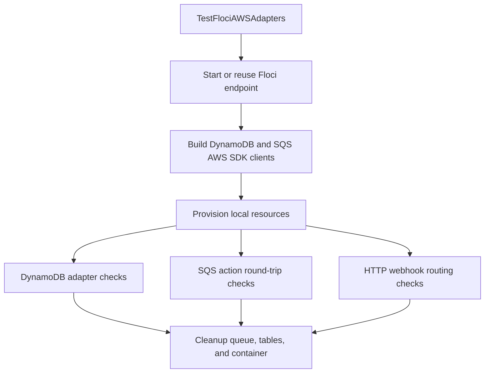

# `internal/integration`

## Purpose

This package contains the opt-in Floci-backed integration test for local AWS
adapter coverage.

It:

- starts a local Floci AWS emulator through Testcontainers-Go
- provisions temporary DynamoDB tables and an SQS queue
- exercises the real AWS SDK v2 DynamoDB and SQS adapters
- verifies queue action round-trips for every command action shape

It does not run as part of the fast test or coverage gate.

## Running

```bash
make integration
```

The target runs the slow Buck `go_test` target:

```bash
buck2 test -m toolchains//:race //internal/integration:floci_integration_test -- --env SLOW_TESTS=1
```

Environment variables:

- `SLOW_TESTS=1` is required; otherwise the test skips.
- `FLOCI_ENDPOINT` reuses an already-running Floci-compatible AWS endpoint.
- `FLOCI_IMAGE` overrides the default `floci/floci:latest` container image.
- `AWS_REGION` overrides the local AWS SDK region, defaulting to `eu-west-1`.

`make test` excludes this target through the Buck `slow` label. `make coverage`
also filters it out of the coverage target list.

## Flow



## Covered Flows

### Local AWS setup

- Starts Floci through Testcontainers-Go unless `FLOCI_ENDPOINT` is set.
- Waits for the Floci readiness endpoint before running checks.
- Builds real AWS SDK DynamoDB and SQS clients with endpoint overrides.
- Creates the message table with `chatId` as the hash key and `dateCreated` as
  the range key.
- Creates the chat table with `chatId` as the hash key.
- Creates a temporary SQS queue.
- Deletes the queue, tables, and container during test cleanup.

### DynamoDB adapter flow

- Saves chat metadata through `dynamodb.NewChatClient`.
- Reads the chat back through `Get`.
- Verifies `chatTitle` and the default `enableAllJung=true` value.
- Updates off-work settings with `offTime=1830` and Thursday workday bits.
- Scans due chats through `DueChatIDs`.
- Saves one message through `dynamodb.NewMessageClient`.
- Queries messages by chat and verifies `username`, `userID`, and
  `dateCreated`.

### SQS action flow

Each case is built through the production command or schedule builders, sent
through real Floci SQS, received back, decoded, compared, then deleted.

Telegram command actions:

- `/jungHelp`
- `/topTen`
- `/topDiver`
- `/allJung`
- `/enableAllJung`
- `/disableAllJung`
- `/setOffFromWorkTimeUTC 1830 MON,TUE`

Scheduled actions:

- `onOffFromWork`
- `offFromWork`

For every action, the test verifies:

- action name
- message body
- all message attributes
- delete-after-receive path

### HTTP webhook routing flow

- Builds `httpserver.NewServer` with real DynamoDB and SQS adapters.
- Posts a Telegram `/topTen` group webhook through `httptest`.
- Verifies HTTP `200`.
- Reads the saved chat row through `dynamodb.NewChatClient`.
- Queries the saved message row through `dynamodb.NewMessageClient`.
- Receives the queued `topten` action from Floci SQS and compares name, body,
  and attributes.

## Not Covered

This is an adapter integration smoke test, not full product parity coverage.

It does not cover:

- stage HTTP route behaviour
- queue worker polling, dispatch, and handler execution
- service-layer command side effects
- Telegram API calls
- EventBridge Scheduler itself
- DynamoDB pagination
- DynamoDB scale-up behaviour
- AWS IAM, throttling, network, or real AWS service differences
- JavaScript-vs-Go parity from an independent fixture

The SQS assertions intentionally compare Go-produced messages with Go-decoded
messages. That catches adapter and AWS-emulator integration mistakes, but it can
miss compatibility bugs where both Go encode and decode paths share the same
wrong assumption.

## Source Map

- `integration_test.go` owns the slow-test gate and top-level test orchestration.
- `floci.go` starts and stops the Testcontainers Floci container.
- `aws.go` creates AWS SDK clients and temporary AWS resources.
- `checks.go` contains the DynamoDB and SQS flow assertions.
- `webhook_checks.go` contains the HTTP webhook routing assertions.
- `BUCK` defines the slow Buck `go_test` target.
