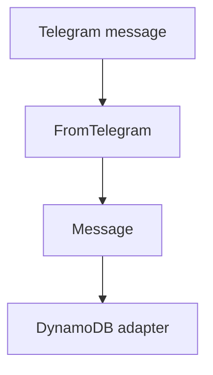
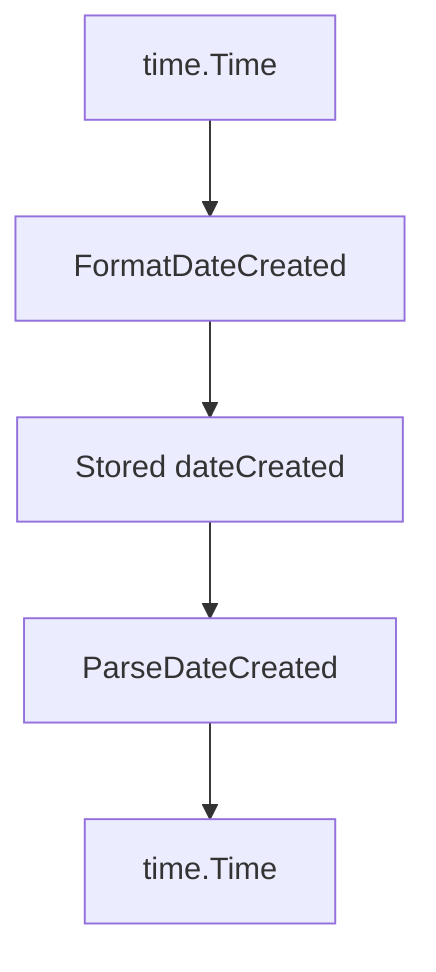

# `internal/message`

## Purpose

This package owns persisted Telegram message models and contract helpers.

It:

- converts Telegram messages into stored rows
- formats and parses `dateCreated`
- computes message TTL

It does not talk to DynamoDB directly.

## Dependencies

This package depends on:

- `internal/telegram`

## Flow

### Store flow

- `FromTelegram` builds the stored message row

### Date flow

- stored `dateCreated` keeps the contract UTC+8 format

## Scope

This package owns:

- message models
- `dateCreated` formatting
- TTL calculation

## Validation

Parsing fails when:

- stored `dateCreated` is malformed
