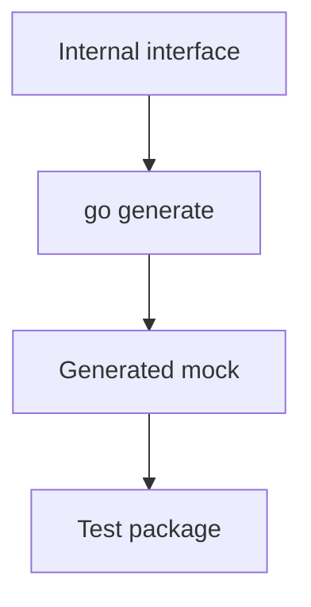

# `internal/mock`

## Purpose

This package stores generated mocks used by internal package tests.

It:

- centralizes generated GoMock files
- keeps generated mocks out of package-local test files

It does not own runtime behaviour.

## Dependencies

This package depends on:

- `go.uber.org/mock/gomock`

## Flow

- generation instructions live next to the source interface
- generated code is written into this package

## Scope

This package owns:

- generated mocks only
