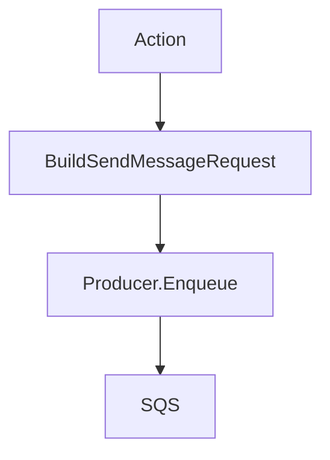
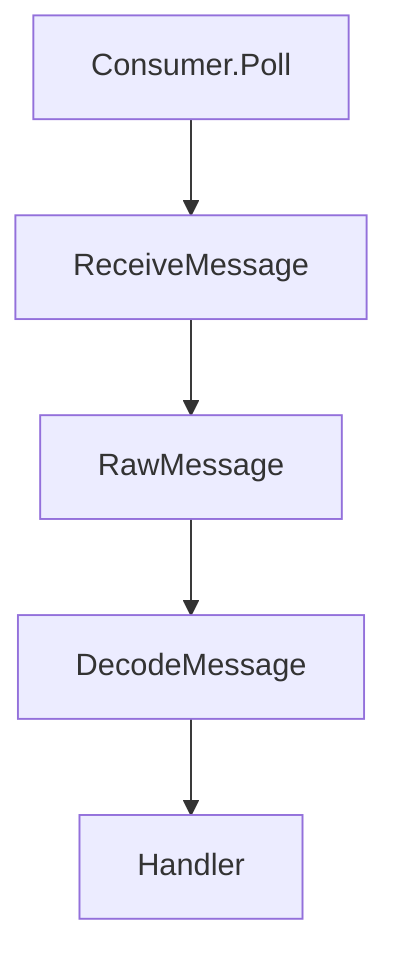

# `internal/queue`

## Purpose

This package owns queue action models, queue request shapes, and the SQS adapter.

It:

- defines stable action names and bodies
- decodes raw queue messages
- builds send and delete requests
- polls and dispatches queue batches
- adapts the AWS SQS SDK

It does not own worker action behaviour.

## Dependencies

This package depends on:

- AWS SQS SDK

## Flow

### Enqueue flow

- `Producer` turns one action into the contract SQS send shape

### Consume flow

- `Consumer.Poll` receives one batch
- each message is handled concurrently inside the batch
- the first handler error is returned

## Scope

This package owns:

- queue action models
- queue request and response shapes
- queue batch polling
- SQS encoding and decoding

## Validation

Calls fail when:

- the queue sender is missing
- the queue receiver is missing
- the queue handler is missing
- SQS send, receive, or delete fails

## Fallbacks

These do not fail:

- unknown queue action names, which decode to an `Action` and can be ignored by the worker layer
- missing `action` message attributes, which decode to the zero action
