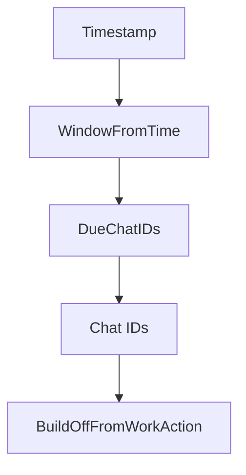
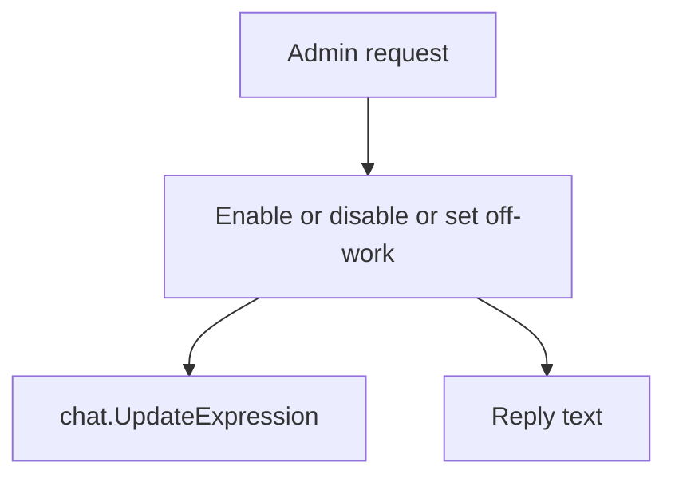

# `internal/schedule`

## Purpose

This package owns off-work scheduling and admin setting rules.

It:

- turns timestamps into schedule windows
- filters due chats to chat IDs
- builds off-work queue actions
- builds admin setting changes and reply text

It does not send messages or talk to DynamoDB directly.

## Dependencies

This package depends on:

- `internal/chat`
- `internal/queue`
- `internal/workday`

## Flow

### Due report flow

- one timestamp becomes one off-work window
- timestamps are normalised to UTC before calculating the window
- due chat rows are reduced to just the chat IDs to fan out

### Admin setting flow

- admin-only changes produce an update plus the matching reply text

## Scope

This package owns:

- off-work window calculation
- due-chat selection
- admin setting changes
- schedule reply text

## Validation

Setting changes fail when:

- the workday list is invalid

These do not fail:

- non-admin setting requests, which become no-op changes
