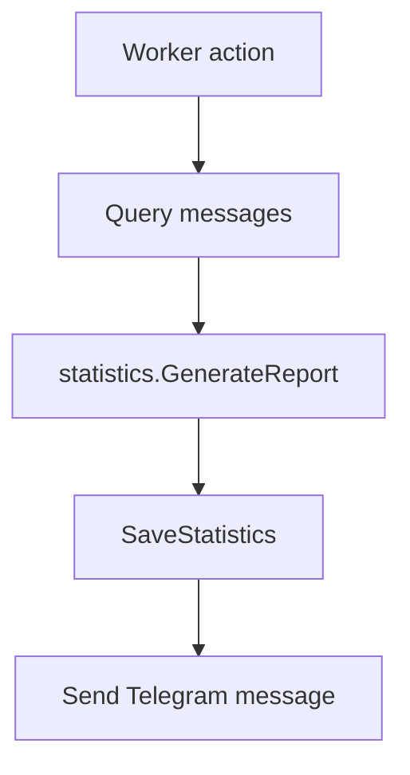
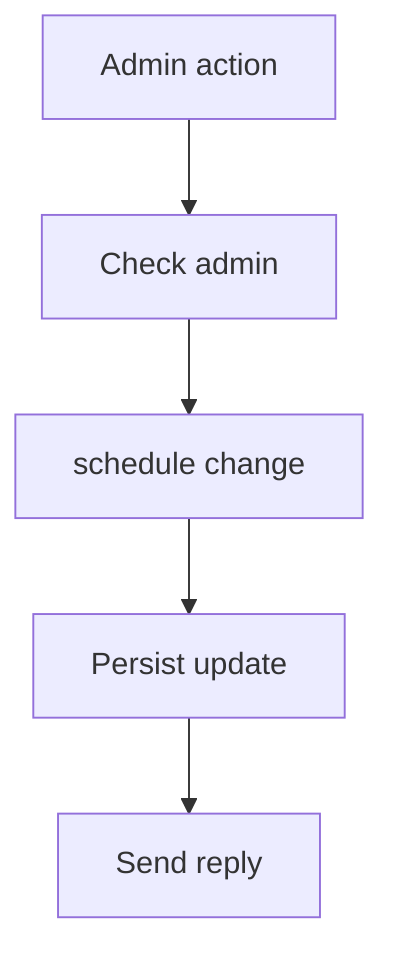
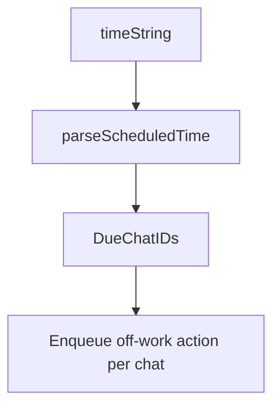

# `internal/service`

## Purpose

This package owns the bot actions executed by the worker.

It:

- sends reports
- sends help
- applies admin setting changes
- fans out scheduled off-work actions

It does not own HTTP transport or queue polling.

## Dependencies

This package depends on:

- `internal/chat`
- `internal/dynamodb`
- `internal/message`
- `internal/queue`
- `internal/schedule`
- `internal/statistics`
- `internal/telegram`
- `internal/worker`

## Flow

### Report flow

- report actions load message history
- render the report
- save chat counts
- then send the Telegram message

### Admin setting flow

- admin-gated actions become schedule changes first
- allowed changes are stored before the reply is sent

### Scheduled fan-out flow

- scheduled fan-out parses one timestamp and enqueues one off-work action per due chat

## Scope

This package owns:

- worker-facing bot actions
- report orchestration
- admin setting orchestration
- scheduled fan-out orchestration

## Validation

Actions fail when:

- required storage or messenger calls fail
- the scheduled time string is invalid
- queue fan-out fails

## Fallbacks

These do not fail:

- disabled `allJung` chats, which return without sending a report
- Telegram 4xx and 5xx report send errors, which are ignored to match the reference behaviour
