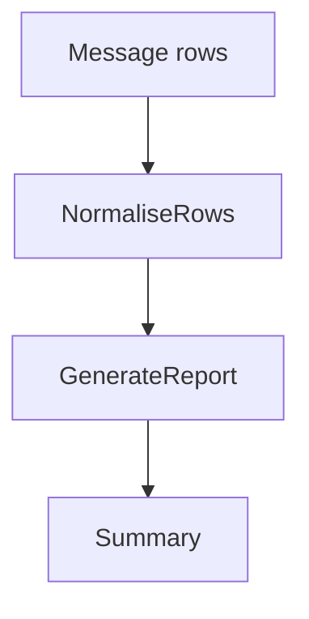
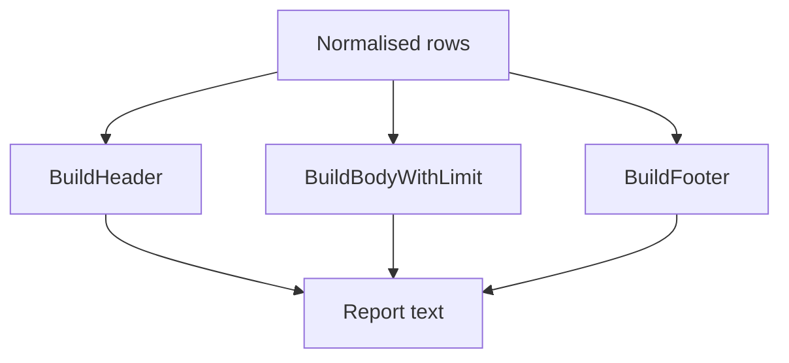

# `internal/statistics`

## Purpose

This package renders chat activity reports.

It:

- groups rows by user
- sorts rankings
- builds report header, body, and footer
- truncates rendered output to the Telegram-safe limit

It does not query message storage or send Telegram messages.

## Dependencies

This package depends on:

- `internal/message`
- `internal/telegram`

## Flow

### Report flow

- rows are grouped and counted first
- then the report text is rendered from the normalised rankings

### Render flow

- body rendering stops once the final rune limit would be exceeded

## Scope

This package owns:

- report ranking rules
- report text rendering
- report truncation

## Validation

Report generation fails when:

- the input row list is empty

## Fallbacks

These do not fail:

- zero `Now`, which falls back to the current time
- zero `WindowDays`, which falls back to the default 7-day window
