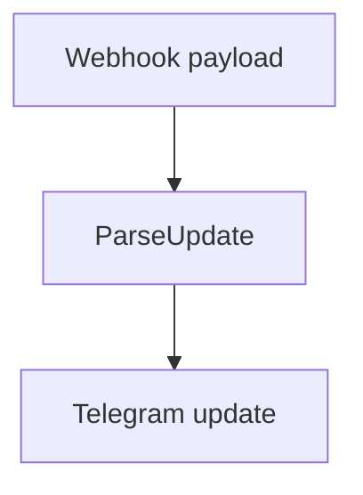
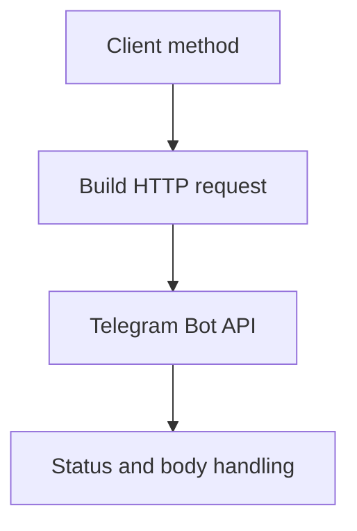

# `internal/telegram`

## Purpose

This package owns Telegram transport models and the Telegram Bot API client.

It:

- parses webhook updates
- sends Telegram messages
- checks chat administrators
- truncates report text to the Telegram-safe limit

It does not own bot command or report rules.

## Dependencies

This package depends on:

- Go HTTP client

## Flow

### Webhook parse flow

- `ParseUpdate` turns raw webhook JSON into the Telegram transport shape

### API call flow

- `SendMessage`, `GetChatAdministrators`, and `IsAdmin` all go through the shared HTTP client

## Scope

This package owns:

- Telegram transport models
- Telegram API client calls
- report truncation

## Validation

Calls fail when:

- the webhook payload is empty or invalid
- Telegram returns a non-2xx status
- a Telegram response body cannot be decoded
