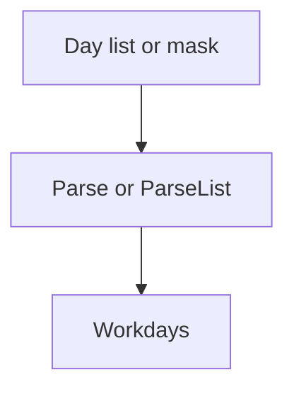
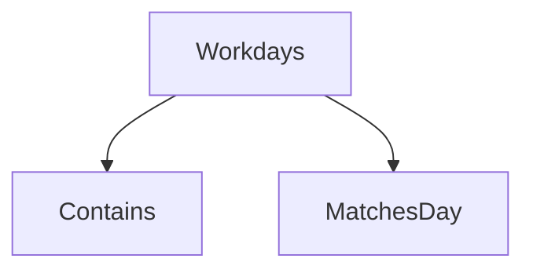

# `internal/workday`

## Purpose

This package owns the stored workday bitmask rules.

It:

- validates stored bitmasks
- parses contract day lists
- checks whether a day matches a mask

It does not own schedule orchestration.

## Dependencies

This package has no internal package dependencies.

## Flow

### Parse flow

- `Parse` validates one stored bitmask
- `ParseList` converts one contract comma-separated list into the same bitmask type

### Match flow

- `Contains` checks a real date
- `MatchesDay` checks one contract day token

## Scope

This package owns:

- workday bit constants
- bitmask validation
- list parsing
- day matching

## Validation

Parsing fails when:

- a mask contains unknown bits
- a day list is empty
- a day list contains an invalid token
