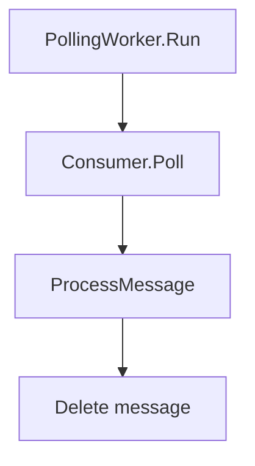
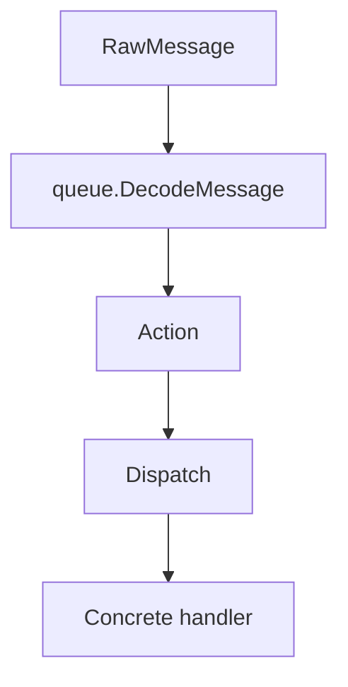

# `internal/worker`

## Purpose

This package owns queue action dispatch and delete-after-handle behaviour.

It:

- builds the polling worker
- decodes queue messages
- routes actions to handlers
- deletes messages after successful handling

It does not own queue transport or bot action rules.

## Dependencies

This package depends on:

- `internal/queue`

## Flow

### Polling flow

- `Run` keeps polling until the context is cancelled
- successful handling is followed by queue deletion

### Dispatch flow

- action dispatch is table-driven
- unknown actions are ignored
- handler errors keep the message undeleted but do not stop polling

## Scope

This package owns:

- worker construction
- action dispatch
- delete-after-success behaviour

## Validation

Worker creation or execution fails when:

- the queue receiver is missing
- the queue deleter is missing
- message decode fails
- queue delete fails
